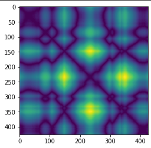
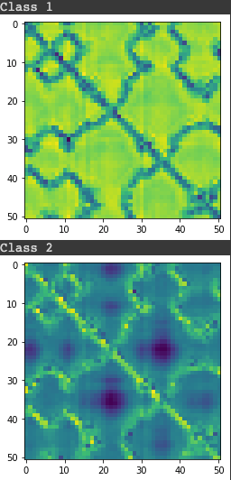

# Recurrence Plot with CAM 
Imaging time series data by RP (Recurrence Plot) and interpret to explainable model by CAM.

## RP (Recurrence Plot)
  
RP converts time series to matrix depends on correlation distance of each time step.
Since it represented of distance matrix, it has symmetry image.

## CAM (Class Activation Mapping)
  
I've applied GMP(Global Max Pooling) for CNN architecture for visualize judgment criteria.
And then, perform weighted sum with between feature map before GMP and after GMP.

# Improvements
* it seems to need optimization of architecture to improve model performance.
* Compare with time series converting algorithm with Fourier transformation (melspectogram).
* Reduce informational loss by GMP. : To apply 1 by 1 convolutional layer.